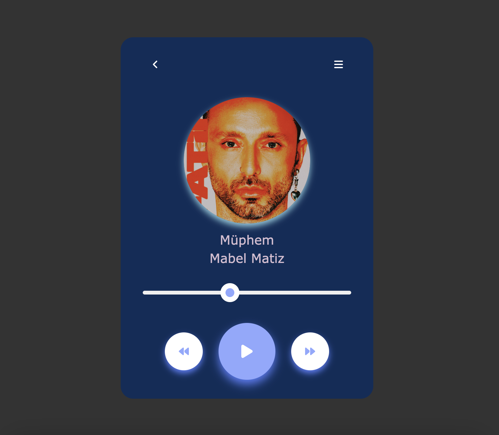

# music-player
This open-source music player project is a web application created using HTML, CSS, and JavaScript. Its primary purpose is to allow users to listen to their personal music collections online.

## Overview

This open-source music player project is designed to enhance and customize users' personal music experience through a web application. The project utilizes modern web technologies, making it easy for users to navigate and manage their music collections.

## Features

- Song control with music play and pause functions.
- Song progression using a time bar.
- Ability to create, edit, and save playlists.
- Adding songs you're listening to as favorites and managing your music collection.

## Deploy

https://emrhdmn.github.io/music-player-main/

- Clone the project to your local machine: 
- Open the project in a modern web browser.
- Upload your music or start listening to the sample music provided by the project.

Please note that there is a typo in the "Deploy" section, and "t" does not seem to be a valid command. You should replace "t" with the actual command or steps needed to clone the project to your local machine.

## Screen

